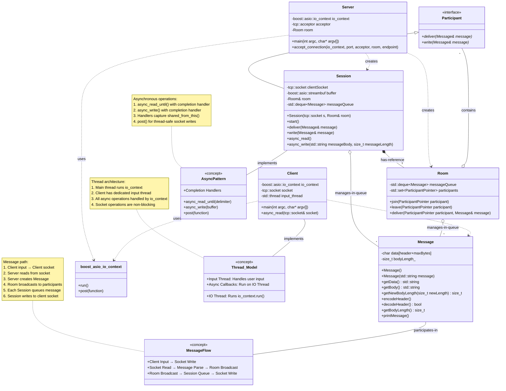

# chatRoomCpp

## Project Overview

chatRoomCpp is a simple chat room application implemented in C++ using Boost.Asio for asynchronous network communication and threading for handling concurrent client connections. It allows multiple clients to connect to a server and exchange messages in a chat room.

## Key Features

*   **Asynchronous Communication:** Uses Boost.Asio for non-blocking I/O, allowing the server to handle multiple clients concurrently.
*   **Multi-threading:** Employs threading to manage multiple client sessions simultaneously.
*   **Room Management:** Provides a simple room abstraction for managing connected clients.
*   **Message Handling:** Encapsulates message handling logic for encoding, decoding, and delivering messages.

## Architecture

The project consists of the following key components:

*   **`Session`:** Represents a client session, handling communication with a specific client. It is responsible for reading incoming messages, delivering outgoing messages, and managing the client socket.
*   **`Room`:** Represents a chat room, managing a set of connected clients. It is responsible for adding and removing clients, and delivering messages to all participants in the room.
*   **`Message`:** Represents a message exchanged between clients. It is responsible for encoding and decoding the message header and body.

## Critical Functionalities

### Async I/O

The application uses Boost.Asio for asynchronous I/O, which allows the server to handle multiple client connections without blocking. The `async_read` and `async_write` methods in the `Session` class are used to asynchronously read data from and write data to the client socket.

### Threading

The application uses threading to handle concurrent client connections. Each client session is run in a separate thread, allowing the server to handle multiple clients simultaneously.

### Session Management

The `Session` class manages a client's connection to the chat room. It handles the asynchronous reading and writing of messages, and ensures that messages are delivered to the correct recipients.

### Room Management

The `Room` class manages the chat room itself. It keeps track of all connected clients, and provides methods for adding and removing clients, and for delivering messages to all participants in the room.

## LLD

## Build and Run

To build and run the project, follow these steps:

1.  Clone the repository.
2.  Run `make` to build the project.
3.  Run `./chatApp <port>` to start the server, replacing `<port>` with the port number you want to use.
4.  Run `./clientApp <port>` to start a client, replacing `<port>` with the port number the server is running on.
